# Financial Analysis AI Agents with LangGraph

A comprehensive financial analysis system that uses LangGraph to orchestrate AI agents for stock analysis and automated report generation. The system fetches real-time financial data using yfinance, performs technical and fundamental analysis, and generates professional investment reports with workflow visualizations.

## 🌟 Features

### Core Financial Analysis
- **Multi-Stock Analysis**: Analyze single stocks, compare multiple stocks, or evaluate entire portfolios
- **Technical Analysis**: RSI, moving averages, volatility analysis, trend signals
- **Fundamental Analysis**: P/E ratios, profitability metrics, growth analysis, financial health
- **Market Sentiment**: AI-powered news sentiment analysis using OpenAI GPT-4
- **Automated Visualizations**: Price charts with technical indicators (PNG format)
- **Real-time Data**: Live stock data via yfinance API
- **LangGraph API Server**: RESTful API for programmatic access

### Financial Data Analysis with LangGraph

Multi-Stock Analysis: Analyze single stocks, compare multiple stocks, or evaluate entire portfolios
Technical Analysis: RSI, moving averages, volatility analysis, trend signals
Fundamental Analysis: P/E ratios, profitability metrics, growth analysis, financial health
Market Sentiment: AI-powered news sentiment analysis
Automated Visualizations: Price charts with technical indicators
Real-time Data: Live stock data via yfinance API

### AI-Powered Report Writer

Professional Reports: Executive summaries, detailed analysis, investor presentations
Multiple Formats: Structured reports with market analysis, technical/fundamental sections
Risk Assessment: Comprehensive risk analysis and mitigation strategies
Investment Recommendations: Actionable buy/hold/sell recommendations with rationale
Automated Compilation: Multi-section reports with proper formatting and disclaimers

### Workflow Visualization

LangGraph Workflow Diagrams: Visual representation of analysis processes
Execution Traces: Step-by-step workflow progress tracking
Analysis Dashboards: Combined view of results and process flow
Interactive Charts: Professional financial charts with technical indicators

### 🔍 LangSmith Integration for Production-Ready AI
- **Real-time Performance Monitoring**: Track AI model performance across all workflow nodes
- **Debugging and Tracing**: Detailed insights into GPT-4 decision-making processes
- **Quality Assurance**: Continuous validation of AI-generated economic insights
- **Error Detection**: Automated identification of analytical inconsistencies
- **Cost Optimization**: API usage tracking and optimization recommendations
- **Workflow Analytics**: Performance metrics for continuous improvement

📊 Sample Analysis Results

### Example: Apple Inc. (AAPL) Analysis


### Example: NVIDIA Inc. (NVDA) Workflow


## 🚀 Quick Start

### Prerequisites
- **Python 3.11+** (Required for LangGraph in-memory server)
- **OpenAI API Key** (Required for AI analysis)
- **LangSmith API Key** (Optional, for monitoring and tracing)

### 1. Installation

```bash
# Clone the repository
git clone https://github.com/NatalieCheong/Financial_Systems_using_LangGraph.git
cd Financial_Systems_using_LangGraph

# Create virtual environment with Python 3.11
python3 -m venv venv
source venv/bin/activate  # On Windows: venv\Scripts\activate

# Install dependencies
pip install -r requirements.txt
```

### 2. Environment Setup

```bash
# Create .env file with your API keys
cat > .env << EOF
OPENAI_API_KEY=your_openai_api_key_here
LANGSMITH_API_KEY=your_langsmith_api_key_here
LANGCHAIN_TRACING_V2=true
LANGCHAIN_ENDPOINT=https://api.smith.langchain.com
LANGCHAIN_PROJECT=financial-analysis
EOF
```

### 3. Start the LangGraph Local Deployment

```bash
# Start the development server
langgraph dev
```

The server will start and you'll see:
```
- 🚀 API: http://127.0.0.1:2024
- 🎨 Studio UI: https://smith.langchain.com/studio/?baseUrl=http://127.0.0.1:2024
- 📚 API Docs: http://127.0.0.1:2024/docs
```

### Example Analysis Results

The system will return comprehensive analysis including:

- **Technical Analysis**: RSI, moving averages, trend signals
- **Fundamental Analysis**: P/E ratios, profitability metrics
- **Market Sentiment**: AI-generated sentiment analysis
- **Investment Insights**: Comprehensive analysis and recommendations
- **Chart Generation**: Professional stock charts saved to `charts/` folder

## 📁 Project Structure

```
Financial_Systems_LangGraph/
├── requirements.txt              # Python dependencies (Python 3.11+ compatible)
├── config.py                    # Configuration settings
├── .env.template                # Environment variables (create this)
├── langgraph.json               # LangGraph configuration
├── studio_config.py             # LangGraph studio configuration
├── financial_data_agent.py      # Core financial data fetching and analysis
├── financial_data_report.py     # AI report generation agent 
├── langgraph_financial_agent.py # LangGraph workflow for financial analysis
├── main.py                      # Main application and CLI interface
├── workflow_visualization.html  # Visual workflow representation
├── charts/                      # Generated charts (auto-created)
├── reports/                     # Generated reports (auto-created)
```

## 🔧 Configuration

### Analysis Types
- **single**: Analyze one stock in detail
- **comparison**: Compare multiple stocks side-by-side
- **portfolio**: Analyze stocks as a portfolio

### Time Periods
- **1d, 5d**: Short-term analysis
- **1mo, 3mo, 6mo**: Medium-term analysis
- **1y, 2y, 5y**: Long-term analysis
- **ytd, max**: Year-to-date or maximum available data

### Supported Stock Symbols
Any valid stock symbol supported by Yahoo Finance:
- **US Stocks**: AAPL, MSFT, GOOGL, AMZN, TSLA, NVDA, etc.
- **International**: Use appropriate exchange suffixes (e.g., TSX:SHOP, LON:VOD)

## 📈 LangGraph Workflow

The system uses LangGraph to orchestrate a sophisticated 7-step analysis workflow:

```mermaid
graph TD
    A[📊 Data Collection] --> B[📈 Technical Analysis]
    B --> C[📊 Fundamental Analysis]
    C --> D[🎭 Market Sentiment]
    D --> E[💡 Generate Insights]
    E --> F[📊 Create Visualizations]
    F --> G[🎯 Final Recommendations]
```



### Detailed Workflow Steps

1. **Data Collection**: Fetch stock data, news, and financial metrics from Yahoo Finance
2. **Technical Analysis**: Calculate RSI, moving averages, volatility, and trend signals
3. **Fundamental Analysis**: Evaluate P/E ratios, profitability, growth, and financial health
4. **Market Sentiment**: AI-powered news sentiment analysis using OpenAI GPT-4
5. **Generate Insights**: LLM-powered comprehensive analysis and observations
6. **Create Visualizations**: Generate professional PNG charts with technical indicators
7. **Final Recommendations**: Provide specific investment recommendations with rationale

## 🎯 Generated Outputs

### Analysis Results
- **Technical Analysis**: RSI, moving averages, trend signals, volatility metrics
- **Fundamental Analysis**: P/E ratios, profitability, growth, financial health
- **Market Sentiment**: AI-generated sentiment based on news and price movements
- **Investment Insights**: Comprehensive analysis and market observations
- **Recommendations**: Specific buy/hold/sell recommendations with detailed rationale

### Files Generated
- **Charts**: `charts/{SYMBOL}_chart.png` - Professional stock charts with technical indicators
- **Reports**: `reports/` - Comprehensive analysis reports (if report generation is enabled)
- **Workflow Visualization**: `workflow_visualization.html` - Visual representation of the analysis process

### Performance Optimization

- **Memory Usage**: The system uses efficient state management to minimize memory usage
- **API Costs**: Optimized prompts to minimize OpenAI API calls
- **Processing Speed**: Parallel processing where possible, with progress tracking
- **Error Recovery**: Graceful error handling with detailed logging

### **LangSmith Analytics**
- **Performance Dashboards**: Real-time monitoring of AI model performance
- **Trace Analysis**: Detailed execution logs for debugging and optimization
- **Quality Metrics**: Validation scores and consistency tracking
- **Cost Analytics**: API usage patterns and optimization insights
  
## 🎨 Visualization Options

### 1. Financial Charts
- **Location**: `charts/{SYMBOL}_chart.png`
- **Content**: Stock price with moving averages, volume analysis
- **Format**: High-resolution PNG files

### 2. Workflow Visualization
- **Location**: `workflow_visualization.html`
- **Content**: Interactive HTML showing the 7-step analysis process
- **Access**: Open in any web browser

### 3. LangGraph Studio (Cloud)
- **URL**: https://smith.langchain.com/studio
- **Connection**: Connect to `http://127.0.0.1:8123`
- **Features**: Real-time workflow execution, step-by-step debugging

## 🔐 Security and Best Practices

- **API Key Management**: Use environment variables, never commit keys to version control
- **Data Privacy**: All processing happens locally, only API calls go to external services
- **Error Handling**: Comprehensive error handling with detailed logging
- **Input Validation**: All inputs are validated before processing
- **Rate Limiting**: Built-in rate limiting for API calls

## 🚀 Advanced Usage

### Custom Analysis Parameters

```json
{
  "assistant_id": "your_assistant_id",
  "input": {
    "symbols": ["AAPL", "MSFT", "GOOGL"],
    "analysis_type": "comparison",
    "period": "6mo",
    "messages": [
      {
        "content": "Compare these technology stocks and provide investment recommendations",
        "role": "user"
      }
    ]
  }
}
```

### Multiple Stock Analysis

```json
{
  "assistant_id": "your_assistant_id",
  "input": {
    "symbols": ["AAPL", "MSFT", "GOOGL", "AMZN", "TSLA"],
    "analysis_type": "portfolio",
    "period": "1y",
    "messages": [
      {
        "content": "Analyze this technology portfolio and provide diversification recommendations",
        "role": "user"
      }
    ]
  }
}
```

## 📊 Sample Results

### Apple Inc. (AAPL) Analysis Example
- **Current Price**: $XXX.XX
- **Technical Signal**: Bullish trend with RSI in neutral territory
- **Fundamental Assessment**: Strong profitability with reasonable valuation
- **Market Sentiment**: Positive based on recent news and price movements
- **Recommendation**: HOLD with moderate confidence
- **Risk Level**: Moderate volatility with strong financial health

### Generated Chart Features
- **Price Chart**: Close price with 20-day and 50-day moving averages
- **Volume Analysis**: Trading volume with trend indicators
- **Technical Indicators**: RSI, volatility, and trend signals
- **Professional Formatting**: Clean, publication-ready charts

## 🙏 Acknowledgements

### **YFinance**
For providing comprehensive, reliable financial data that serves as the foundation for all analysis conducted by this platform. 

### **OpenAI**
For the GPT-4 technology that powers the AI-enhanced financial analysis and insight generation capabilities. The advanced language model enables sophisticated interpretation of financial data.

### **LangGraph**
For the workflow orchestration framework that enables sophisticated multi-step financial analysis processes. LangGraph's state management and conditional routing capabilities make complex financial analysis workflows possible and maintainable.

### **LangSmith**
For the comprehensive observability, monitoring, and debugging platform that ensures production-ready AI performance. LangSmith's tracing and analytics capabilities enable continuous improvement and reliable operation of AI-powered financial analysis.


## ⚠️ Important Disclaimers

**INVESTMENT DISCLAIMER**: This software is for educational and informational purposes only and does not constitute investment advice. All investments carry risk of loss. Past performance does not guarantee future results.

**TECHNICAL DISCLAIMERS**:
- Financial data accuracy depends on third-party sources (Yahoo Finance)
- AI analysis is based on historical data and current market conditions
- System recommendations are not guaranteed to be profitable
- Users are responsible for conducting their own due diligence

**LIABILITY LIMITATION**: The developers assume no responsibility for any financial losses resulting from the use of this software.

## 📄 License

This project is provided as an educational example for building AI agents with LangGraph for financial analysis. Use at your own risk and in accordance with applicable financial regulations in your jurisdiction.

